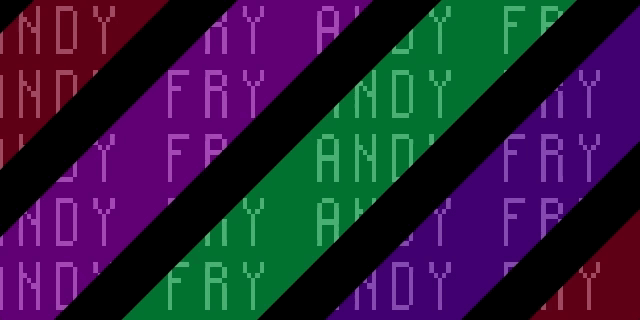

# Scrolling names
A project inspired by this [wonderful, odd music video](https://www.youtube.com/watch?v=Q0YvQrrepP4). The letters were created with CSS Grid, and the animation effect is a series of colored and black bars overlaid on top of the letters. Not quite a perfect recreation of the cool scrolling neon letter effect from the video, but close.  

Q: Did it require 20,000 lines of markup to achieve?
A: Yes, absolutely. Shoutout to my laptop and Atom for not crashing a single time during the making of this.

